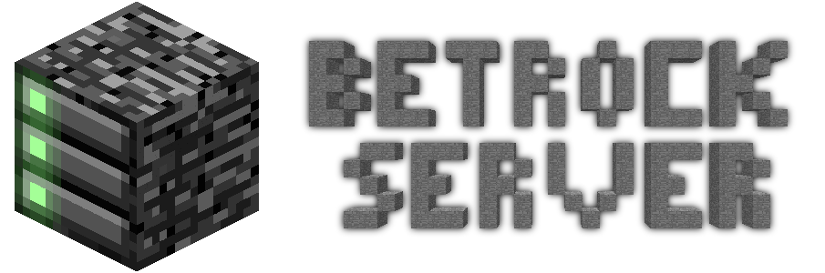
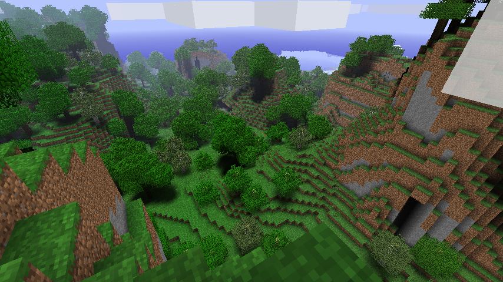

[](https://discord.gg/JHTz2HSKrf)


A Minecraft Beta 1.7.3 Server written in C++23. The goal being to have a semi-modern Beta 1.7.3 server that people can muck about with however they like, and to not have to deal with plugins that're over a decade old.

## Features
(as of 0.3.0)
- Players can connect, chat, build and explore
- Lots of Commands
- (very) accurate Beta 1.7.3 Terrain
- Lua-driven World Generation
- World saving and loading (**not** in McRegion format yet)
- Extensive multi-threading

## Discord
We have a [Discord Server](
https://discord.gg/JHTz2HSKrf)!

## Screenshots

| Glacier | pack.png | Gargamel |
|--- | --- |--- |
|  |  |  |

## Getting Started
How do you run your own BetrockServer instance?

If you're on Linux, simply follow the steps listed below. If you're on Windows, please follow these same steps only after installing [Windows Subsystem for Linux (WSL2)](https://learn.microsoft.com/en-us/windows/wsl/install).

## Option 1 - Download
Check the releases page for the latest binary of BetrockServer. Then simply run the executable.

If it complains about lacking a `scripts` folder, download the `src/scripts` folder from the repository and place it alongside the executable.

Downloading can be unreliable, since certain libraries, such as `libdeflate`, may not necessarily be installed. Compiling is honestly the easier and more robust option.

## Option 2 - Compiling
This section is written to be as accessible as possible, so anyone can compile BetrockServer.

### Install Dependencies
**Debian/Ubuntu**
```bash
sudo apt install git cmake build-essential libdeflate-dev liblua5.4-dev
```
**Arch**
```bash
sudo pacman -Syu git cmake make gcc lua libdeflate
```
**Fedora**
```bash
sudo dnf install git cmake make gcc lua-devel libdeflate libasan
```
This installs all the necessary libraries that BetrockServer needs.

### Clone
```bash
git clone --recurse-submodules https://github.com/OfficialPixelBrush/BetrockServer.git
cd BetrockServer
```
This downloads the repository onto your computer.
```bash
cmake -S . -B build
cd build
```
This configures the development environment.

### Build
```bash
cmake --build .
```
This turns the source code into an executable binary file.

### Running
```bash
./BetrockServer
```
This runs the built executable and generates a new world,
if one isn't already present.

### Packing (For Releasing)
```bash
cpack --config CPackConfig.cmake -G TGZ
```

## Issues
If you encounter **any** issues, inaccuracies to the base game or simply want to provide an idea that may make BetrockServer better,
please report them on the [Issues tab](https://github.com/OfficialPixelBrush/BetrockServer/issues).

Please check if the issue you've found has already been reported or even been solved already.

If not, create a **new issue** and fill out all the necessary information according to the `Bug Report` template to the best of your abilities.

## Misc
- [PixNBT](https://github.com/OfficialPixelBrush/pixnbt) - A C++ native NBT parsing library
- [BetaPacketPlainTextifier](https://github.com/OfficialPixelBrush/BetaPacketPlainTextifier) - A utility for turning WireShark captures of Minecraft Client-Server data into Markdown files for easy decoding
- [Beta Wiki](https://officialpixelbrush.github.io/beta-wiki)

# Contributing
Please read the [CONTRIBUTING](https://github.com/OfficialPixelBrush/BetrockServer/blob/main/CONTRIBUTING.md) page.

# Resources
For further reading, to aid development and sources for where certain info has been gotten from.

Some stuff can be found on the [BetrockServer Wiki](https://github.com/OfficialPixelBrush/BetrockServer/wiki),
especially if you're interested in developing your own [World Generator](https://github.com/OfficialPixelBrush/BetrockServer/wiki/World-Generation) or [Plugin](https://github.com/OfficialPixelBrush/BetrockServer/wiki/Plugins).

If you're more interested in the in-depth technical stuff of Beta 1.7.3, check out [my extended fork of mudkipdev's Beta Wiki](https://officialpixelbrush.github.io/beta-wiki)!

- GitHub
    - [beta-wiki (fork)](https://officialpixelbrush.github.io/beta-wiki) by [OfficialPixelBrush](https://github.com/OfficialPixelBrush/beta-wiki)
    - [beta-wiki (og)](https://github.com/mudkipdev/beta-wiki) by [mudkipdev](https://github.com/mudkipdev)
- Wiki.vg (Now part of the Minecraft Wiki)
    - [Protocol](https://minecraft.wiki/w/Minecraft_Wiki:Projects/wiki.vg_merge/Protocol?oldid=2769758)
    - [Region Files](https://minecraft.wiki/w/Minecraft_Wiki:Projects/wiki.vg_merge/Region_Files)
- Minecraft Wiki
    - [NBT Format](https://minecraft.wiki/w/NBT_format)
    - [Region File Format](https://minecraft.wiki/w/Region_file_format)
    - [Help:Isometric Renders](https://minecraft.wiki/w/Help:Isometric_renders) (Used for the Logo)

# Stats


| Issues | PRs |
| - | - |
|  |  |
|  |  |

| Branch | Commits |
| - | - |
| main |  |
| latest |  |
                        
## Star History

[](https://www.star-history.com/#OfficialPixelBrush/BetrockServer&Date)
